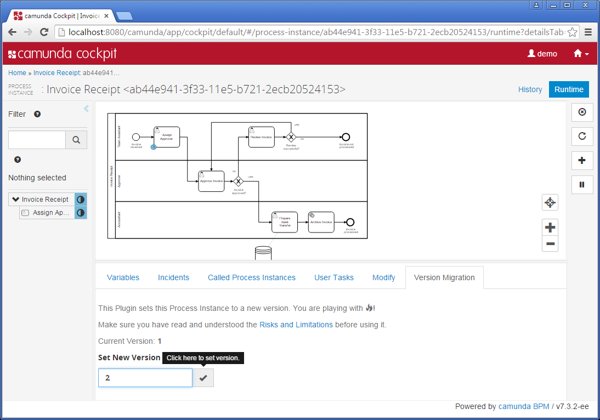

Version Migration Plugin
=========================

With this plugin you are able to migrate a process instance to another process definition version.

But you **must** be aware, that this plugin **can destroy** your process instance.

Risks and limitations of Version Migration
------------------------------------------

Process Version Migration is not an easy topic. Migrating process instances to a new version only works if:

- for all currently existing executions and running tokens the "current activity" with the same id still exists in the new process definition
- the scopes, sub executions, jobs and so on are still valid.

Hence the cases in which this simple instance migration works are limited. The following examples will cause problems:

- If the new version introduces a new (message / signal / timer) boundary event attached to an activity, process instances which are waiting at this activity cannot be migrated (since the activity is a scope in the new version and not a scope in the old version).
- If the new version introduces a new (message / signal / timer) boundary event attached to a subprocess, process instances which are waiting in an activity contained by the subprocess can be migrated, but the event will never trigger (event subscription / timer not created when entering the scope).
- If the new version removes a (message / signal / timer) boundary event attached to an activity, process instances which are waiting at this activity cannot be migrated.
- If the new version removes a timer boundary event attached to a subprocess, process instances which are waiting at an activity contained by the subprocess can be migrated. If the timer job is triggered (executed by the job executor) it will fail. The timer job is removed with the scope execution.
- If the new version removes a signal or message boundary event attached to a subprocess, process instances which are waiting at an activity contained by the subprocess can be migrated. The signal/message subscription already exists but cannot be triggered anymore. The subscription is removed with the scope execution.
- If a new version changes field injection on Java classes, you might want to set attributes on a Java class which doesn't exist any more or the other way round: you are missing attributes.

Other important aspects to think of when doing version migration are:

- Execution: Migration can lead to situations where some activities from the old or new process definition might have never been executed for some process instances. Keep this in mind, you might have to deal with this in some of your own migration scripts.
- Traceability and Audit Trail: Is the produced audit trail still valid if some entries point to version 1 and some to version 2? Do all activities still exist in the new process definition?
- Reporting: Your reports may be broken or show strange figures if they get confused by version mishmash.
- KPI Monitoring: Let's assume you introduced new KPI's, for migrated process instances you might get only parts of the figures. Does this do any harm to your monitoring?

If you cannot migrate your process instance you have a couple of alternatives, for example:

- Continue running the old version.
- Cancel the old process instance and start a new one. The challenge might be to skip activities already executed and "jump" to the right wait state. You can use process instance modification for this.

This project has been generated by the Maven archetype
[camunda-archetype-cockpit-plugin-7.3.0](http://docs.camunda.org/latest/guides/user-guide/#process-applications-maven-project-templates-archetypes).

How to use it?
--------------

You can use `ant` to build and install the plugin to an existing Cockpit
inside an application server.
For that to work you need to copy the file `build.properties.example` to `build.properties`
and configure the path to your application server inside it.
Alternatively, you can also copy it to `${user.home}/.camunda/build.properties`
to have a central configuration that works with all projects generated by the
[Camunda BPM Maven Archetypes](http://docs.camunda.org/latest/guides/user-guide/#process-applications-maven-project-templates-archetypes).

Once you installed the plugin it should appear in
[Camunda Cockpit](http://docs.camunda.org/latest/guides/user-guide/#cockpit).

More information
----------------

[How to install a Cockpit plugin](http://docs.camunda.org/latest/real-life/how-to/#cockpit-how-to-develop-a-cockpit-plugin-integration-into-cockpit)

[How to develop a Cockpit plugin](http://docs.camunda.org/latest/real-life/how-to/#cockpit-how-to-develop-a-cockpit-plugin)

Discover more Cockpit plugins in the
[Camunda Plugin Store](http://camunda.org/plugins/)

Environment Restrictions
------------------------

Built and tested against Camunda BPM version 7.3.0.

Known Limitations
-----------------

Improvements Backlog
--------------------

- Move the plugin from a tab to an action button with a modal popup dialog.

License
-------

[Apache License, Version 2.0](http://www.apache.org/licenses/LICENSE-2.0).
